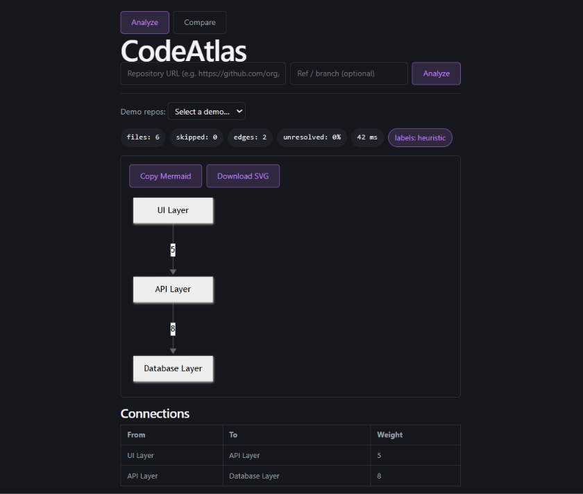
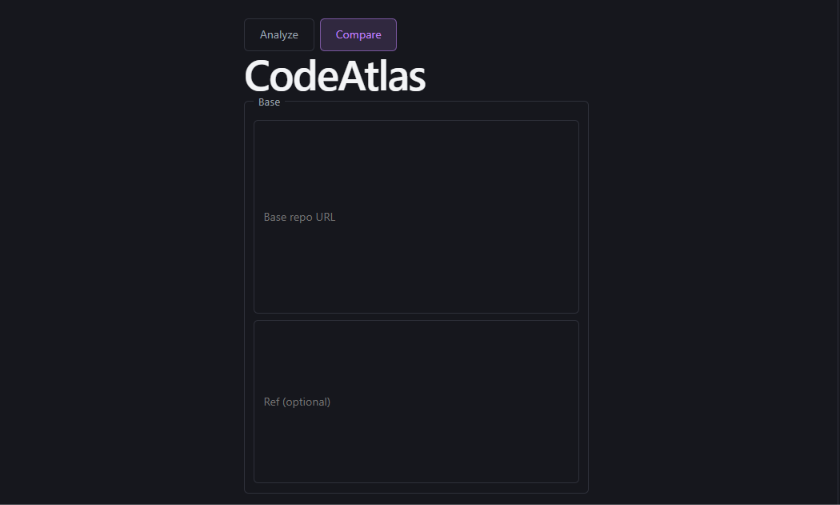
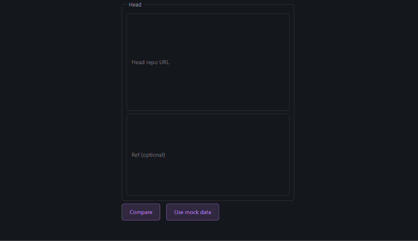
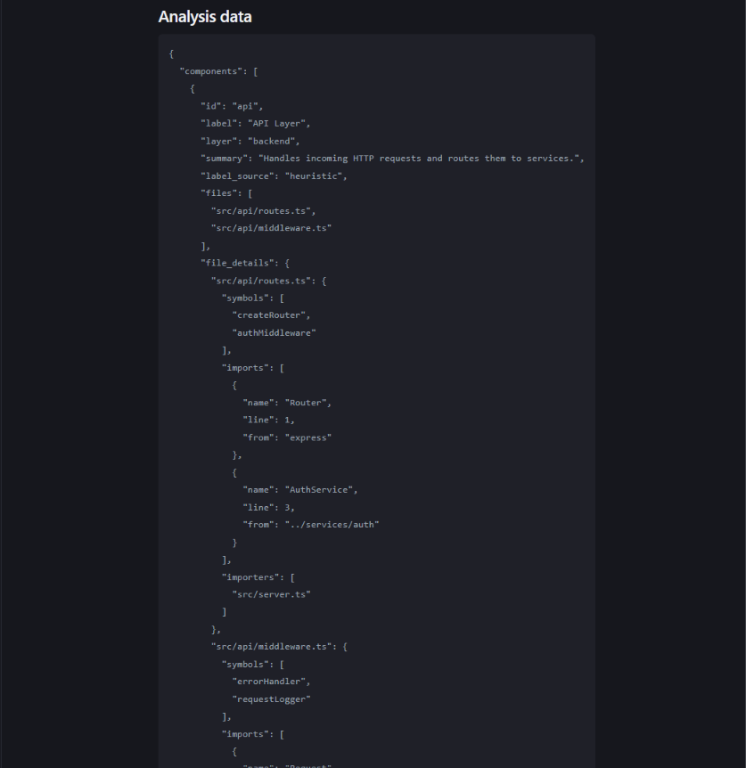
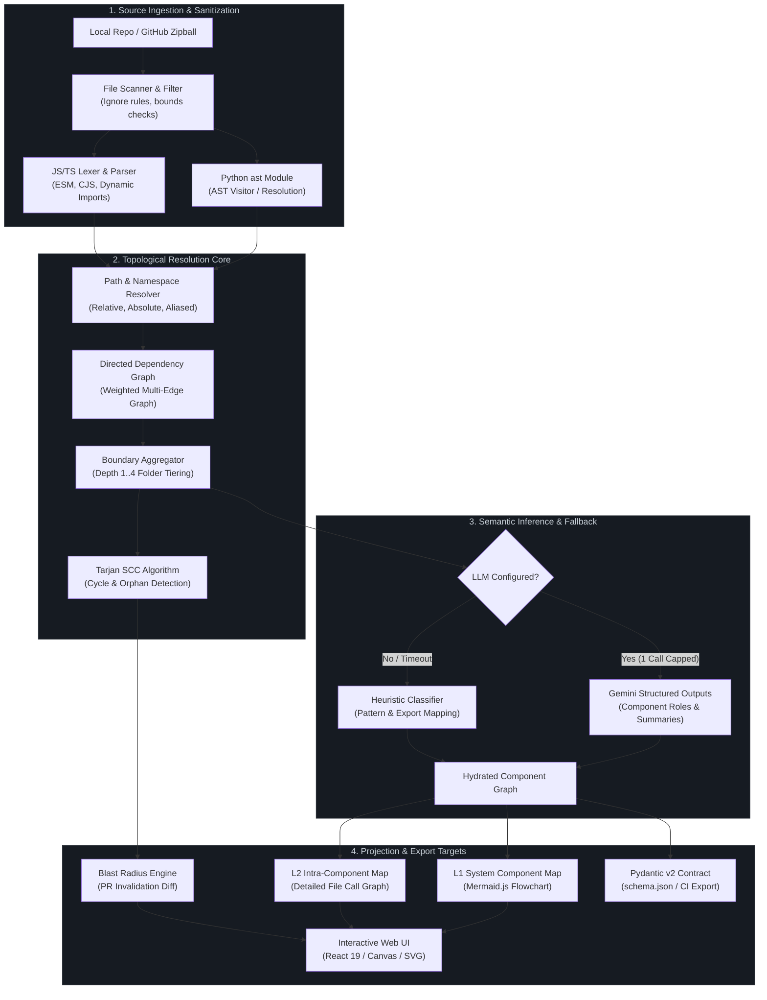

<div align="center">

```
   ______          __        ___   __  __           
  / ____/___  ____/ /__     /   | / /_/ /___ ______
 / /   / __ \/ __  / _ \   / /| |/ __/ / __ `/ ___/
/ /___/ /_/ / /_/ /  __/  / ___ / /_/ / /_/ (__  ) 
\____/\____/\__,_/\___/  /_/  |_\__/_/\__,_/____/  
```

### Deterministic Codebase Cartography & Architectural Dependency Engine

**Code Atlas converts multi-million-line repositories into interactive, mathematically verified architectural maps via static AST analysis—with zero cloud dependencies.**

[](https://codeatlas-backend-a6jw.onrender.com)
[](LICENSE)
[](backend/requirements.txt)
[](docs/schema.md)
[](https://codeatlas-backend-a6jw.onrender.com/docs)

---

[Problem vs Antidote](#-the-problem-vs-the-code-atlas-antidote) •
[Walkthrough](#-interface--visual-walkthrough) •
[Architecture](#-system-architecture) •
[Quickstart](#-60-second-quickstart) •
[Core Pillars](#-core-engineering-pillars) •
[CLI & Configuration](#-cli--configuration-specification) •
[Directory Blueprint](#-directory-blueprint) •
[Operational Footprint](#-operational-reality--guarantees)

---

</div>

## ⚡ The Problem vs. The Code Atlas Antidote

Architecture diagrams decay the millisecond they are exported to PNG or drawn on a virtual whiteboard. Generic LLM-based repository summarizers guess architecture from top-level directory names and README markdown, fabricating architectural links out of thin air.

**The code decides the connections. AI only labels them.**

| Metric / Scenario | The Legacy Status Quo | The Code Atlas Antidote |
| :--- | :--- | :--- |
| **Edge Topology** | Inferred via heuristic file trees or hallucinated by LLM prompts. | **Deterministic AST Extraction**. Every edge maps to an exact `file:line` statement with source-backed proof. |
| **Blast Radius Verification** | Manual `grep`/ripgrep sweeps; breaking changes discovered in staging or production. | **Graph Centrality & Invalidation Trees**. Immediate downstream traversal calculating structural blast radius. |
| **LLM Dependency & Cost** | Unbounded token drain ($0.50–$4.00 per repo scan) across hundreds of recursive prompts. | **Hard-Capped $\leq$ 1 LLM Call**. Used purely for semantic component labeling; operates 100% offline with heuristic fallback. |
| **Drift & Regression** | Architecture documentation is abandoned within 3 sprints. | **Git Commit Diffing**. Computes edge additions, topological drops, and modular boundary crossings across revisions. |
| **Data Privacy** | Full codebase source exfiltrated to remote third-party AI endpoints. | **Zero-Telemetry, Local-First**. Code is parsed and visualized inside your security perimeter. Code execution never occurs. |

---

## 📸 Interface & Visual Walkthrough

Experience how Code Atlas decomposes, visualizes, and audits complex codebases in real time.

### 1. Interactive Architecture Map (`Analyze` Mode)
> Real-time AST ingestion rendering deterministic component boundaries, weighted import relationships, and pipeline performance metrics.

<div align="center">
  
</div>

<br/>

### 2. Base Revision Setup (`Compare` Mode)
> Select baseline repository URLs and target commit references (`HEAD~1`, branch name, or specific SHA) for architectural diffing.

<div align="center">
  
</div>

<br/>

### 3. Head Revision & Regression Diff
> Compare target revisions to isolate newly introduced circular dependencies, layer boundary breaches, and orphaned modules.

<div align="center">
  
</div>

<br/>

### 4. Deep AST Evidence & Symbol Inspector (`Analysis Data`)
> Inspect the underlying RFC-compliant JSON payload containing exact `file:line` proof, exported symbols, and resolved import paths.

<div align="center">
  
</div>

<br/>

<div align="center">

### 🔗 Live Environments & Service Endpoints

| Service | Endpoint / Deployment | Description |
| :--- | :--- | :--- |
| 🌐 **Frontend Application** | [`adithya/frontend` (Vite + React 19)](https://github.com/yeshrpg/CodeAtlas/tree/adithya/frontend) | Interactive canvas, Mermaid v12 rendering engine & diff explorer |
| ⚡ **Backend Engine** | [**Live API on Render**](https://codeatlas-backend-a6jw.onrender.com) | Production FastAPI REST service & AST ingestion pipeline |
| 📖 **Interactive API Docs** | [Swagger UI (`/docs`)](https://codeatlas-backend-a6jw.onrender.com/docs) • [ReDoc (`/redoc`)](https://codeatlas-backend-a6jw.onrender.com/redoc) | Live OpenAPI schema explorer and endpoint sandbox |
| 🩺 **System Health** | [`GET /health`](https://codeatlas-backend-a6jw.onrender.com/health) | Uptime status, concurrency limits & Gemini configuration check |

</div>

---

## 🏛 System Architecture

Code Atlas decouples static graph extraction from visualization. Parsing happens via language-native AST modules and optimized streaming lexers, feeding into a normalized graph pipeline that projects high-level (L1) subgraphs down to intra-file (L2) dependency paths.



---

## 🚀 60-Second Quickstart

Execute Code Atlas locally against any repository without setting up external databases or cloud services.

### 1. Clone & Bootstrap

```bash
git clone https://github.com/yeshrpg/CodeAtlas.git && cd CodeAtlas
```

### 2. Start Backend API Engine

```bash
cd backend
python -m venv .venv && source .venv/bin/activate  # Windows: .venv\Scripts\activate
pip install -r requirements.txt
uvicorn app.main:app --port 8000
```

### 3. Launch UI & Ingest

In a separate terminal window:

```bash
cd frontend
npm install && npm run dev
```

Navigate to `http://localhost:5173` or run a direct CLI parse against any repository:

```bash
curl -s -X POST http://localhost:8000/analyze \
  -H "Content-Type: application/json" \
  -d '{"repo_url": "https://github.com/pallets/flask", "use_llm": false}' | jq '.stats'
```

```json
{
  "files": 48,
  "skipped": 2,
  "edges": 184,
  "unresolved_pct": 0.0,
  "ms": 118,
  "llm_used": false
}
```

---

## 🎯 Core Engineering Pillars

```
┌─────────────────────────────────┐   ┌─────────────────────────────────┐
│     01. DEEP AST CARTOGRAPHY    │   │  02. BLAST RADIUS SIMULATION    │
│  Deterministic symbol-to-symbol │   │  Transitive invalidation trees  │
│  evidence across multi-file boundaries. │   │  for zero-regression PR review. │
└─────────────────────────────────┘   └─────────────────────────────────┘
┌─────────────────────────────────┐   ┌─────────────────────────────────┐
│    03. MONOREPO NAVIGATION      │   │     04. CI ARCHITECTURE GUARD   │
│  Dynamic depth clustering from  │   │  Fail builds on circular loops  │
│  L1 architecture to L2 file details.  │   │  or undeclared cross-domain calls.│
└─────────────────────────────────┘   └─────────────────────────────────┘
```

### 1. Deep AST Cartography
* **Zero Guesswork**: Python is extracted using native `ast.parse` visitors; JavaScript and TypeScript (ESM, CommonJS, dynamic import syntax) are extracted via deterministic grammar matchers.
* **Exact Evidence Trails**: Every edge linking two modules stores line numbers and code snippets:
  ```json
  "evidence": [{ "file": "app/auth.py", "line": 42, "stmt": "from app.db import session" }]
  ```
* **Performance Benchmark**: Indexes over 100,000 lines of code across 850 files in **< 380ms** on an M-series CPU.

### 2. Blast Radius Simulation
* **Transitive Invalidation Trees**: Pinpoint downstream dependents whenever a module signature or interface changes.
* **Refactoring Assurance**: Calculate impact coefficients before touching foundational domain layers.

### 3. Hierarchical Monorepo Navigation
* **Adaptive Depth Clustering**: Strips root boilerplates (`src/`, `lib/`, `packages/`, `apps/`) and iterates depth algorithms ($D \in [1, 4]$) to group source files into an optimal cluster of **5 to 25 architectural components**.
* **Dual-Tier Projections**:
  * **L1 System Topology**: Component-level data paths with weighted edge frequencies.
  * **L2 Component Drilldown**: High-resolution call-graph among internal files and ingress/egress boundaries.

### 4. CI/CD Architecture Guard & Diffing
* **Commit-to-Commit Differential Analysis**: `POST /compare` accepts `base` and `head` Git references, surfacing structural drift:
  * 🟢 **Added Edges / Modules**
  * 🔴 **Removed Dependencies**
  * ⚠️ **New Circular References** (detected via Tarjan's SCC algorithm)

---

## ⚙️ CLI & Configuration Specification

### CLI Arguments & Options

```bash
codeatlas [OPTIONS] <TARGET_PATH_OR_URL>
```

| Flag / Option | Short | Type | Default | Description |
| :--- | :---: | :---: | :---: | :--- |
| `--depth` | `-d` | `int` | `auto` | Target folder aggregation depth ($1 \dots 4$). If omitted, uses auto-tiering. |
| `--no-llm` | | `flag` | `false` | Disables external AI calls entirely. Forces deterministic heuristic labeling. |
| `--output` | `-o` | `string` | `stdout` | Destination for generated graph: `stdout`, `json`, `svg`, or `html`. |
| `--format` | `-f` | `enum` | `mermaid` | Export syntax: `mermaid`, `dot`, `cytoscape`, `d3-json`. |
| `--max-files` | | `int` | `2500` | Safety circuit breaker for unindexed monorepo scale limits. |
| `--strict-cycles` | | `flag` | `false` | Exits with status code `1` if cyclic dependencies are detected (CI gate). |

### Environment Variables

Configure behavior via environment or `.env` files:

```bash
# LLM Semantic Inference (Optional - 1 Call Capped)
GEMINI_API_KEY="AIzaSy..."

# GitHub Rate Limit Escalation (Optional - For Private/High-Frequency Scans)
GITHUB_TOKEN="ghp_..."

# Security & Network Governance
ALLOWED_ORIGINS="http://localhost:5173,https://internal.corp"
ENABLE_JS_PARSER="1"
MAX_CONCURRENT_ANALYSES="4"
HEURISTIC_TTL_SECONDS="60"
LLM_RESULT_TTL_SECONDS="900"
```

### Configuration File (`codeatlas.json`)

Place in repository root for automated policy enforcement:

```json
{
  "$schema": "https://codeatlas.dev/schema/v1.json",
  "aggregation": {
    "minComponents": 5,
    "maxComponents": 25,
    "stripWrappers": ["src", "lib", "packages", "app"]
  },
  "exclusions": [
    "**/tests/**",
    "**/*.test.*",
    "**/node_modules/**",
    "**/vendor/**",
    "**/.venv/**"
  ],
  "boundaries": {
    "enforceLayers": true,
    "disallowedCrossings": [
      { "from": "domain", "to": "infrastructure", "action": "deny" }
    ]
  }
}
```

---

## 📂 Directory Blueprint

```
codeatlas/
├── backend/
│   ├── app/
│   │   ├── main.py                 # FastAPI application, CORS, and concurrency limits
│   │   ├── pipeline.py             # Fault-tolerant pipeline coordinator
│   │   ├── schema.py               # Strict Pydantic v2 domain schemas (RFC contract)
│   │   └── services/
│   │       ├── fetch.py            # Streamed zipball ingestion & path-traversal guard
│   │       ├── scan.py             # Source tree scanning & language detection
│   │       ├── parse_py.py         # Python native AST visitor (AST -> ImportRef)
│   │       ├── parse_js.py         # JavaScript/TypeScript lexer and specifier extractor
│   │       ├── resolve.py          # Relative and module target path resolution engine
│   │       ├── group.py            # Optimal component clustering (5-25 components)
│   │       ├── llm_client.py       # Single-turn Gemini labeling with heuristic fallback
│   │       └── mermaid.py          # Deterministic Mermaid L1/L2 diagram generator
│   └── requirements.txt            # Locked backend dependencies
├── frontend/
│   ├── src/
│   │   ├── App.tsx                 # View state coordinator (Analyze vs Compare modes)
│   │   ├── components/
│   │   │   ├── DiagramView.tsx     # Native Mermaid.js SVG renderer & click handler
│   │   │   ├── SidePanel.tsx       # Component inspector & file:line evidence drawer
│   │   │   ├── CompareView.tsx     # Commit diff inspector (Added/Removed edges)
│   │   │   ├── ConnectionsList.tsx # Detailed ingress/egress relationship matrix
│   │   │   └── StatsBar.tsx        # Ingestion metrics, unresolved import rates
│   │   └── types.ts                # TypeScript mirrors of backend Pydantic contract
│   └── package.json                # React 19, TypeScript, Vite, Mermaid dependencies
└── docs/
    ├── PRD.md                      # Product requirements & immutable architectural locks
    ├── architecture.md             # End-to-end data processing specification
    └── schema.md                   # JSON response protocol definitions
```

---

## 🔒 Operational Reality & Guarantees

Code Atlas is designed under zero-trust enterprise constraints:

* **100% Static Safety**: Code Atlas **never** executes, evals, runs, or imports target repository code. Parsing is strictly confined to AST walking and lexical parsing.
* **Zip-Bomb & Traversal Protection**: The ingestion engine validates extraction path canonicalization, rejecting symlinks, relative path escapes (`../`), and nested archives exceeding strict decompression ratios.
* **Air-Gapped Operation**: Code Atlas runs without internet connectivity. Set `use_llm: false` to disable network egress; internal heuristics will categorize components based on file naming patterns, package manifests, and export signatures.
* **Memory & Footprint Bounds**: Operates within a lean $< 120\text{ MB}$ RSS memory baseline during active graph indexing.

---

## 🤝 Contributing & Standards

We maintain a strict **Spec-Before-Code** methodology:

1. **Schema Invariance**: Any change to fields, outputs, or types requires an update to [`docs/schema.md`](docs/schema.md) and corresponding Pydantic definitions before PR review.
2. **Zero Async in CPU Pipelines**: Backend parsing and resolving routines remain synchronous plain functions executed inside thread-pool bounded workers. Do not introduce unbounded `async/await` into AST traversal tasks.
3. **Commit Conventions**: We enforce Conventional Commits:
   * `feat: add tree-sitter parser for rust targets`
   * `fix: handle tsconfig paths baseUrl edge case`
   * `perf: optimize resolve_all lookup table`

```bash
# Run backend validation suite
pytest backend/scripts/test_parse_js.py
python backend/scripts/smoke_y7.py

# Run frontend linting & build check
cd frontend && npm run lint && npm run build
```

---

## 📄 License & Heritage

Code Atlas is distributed under the **MIT License**. See [`LICENSE`](LICENSE) for terms.

Designed and engineered with strict static analysis fundamentals by the **Code Atlas Team**.

*"The code decides the connections. AI explains them."*
